# GNM head — shape gallery

Min/max renders of every Identity/Expression slider mode (coefficient &minus;3 / +3), identical framing per group. Occluded parts (tongue, teeth, pupils) are shown as isolated zooms. Open a group:

- [identity / head (170 modes)](group_identity---head.md)
- [identity / eyes (3 modes)](group_identity---eyes.md)
- [identity / teeth (80 modes)](group_identity---teeth.md)
- [expression / left_eye_region (100 modes)](group_expression---left-eye-region.md)
- [expression / right_eye_region (100 modes)](group_expression---right-eye-region.md)
- [expression / lower_face_region (150 modes)](group_expression---lower-face-region.md)
- [expression / tongue (32 modes)](group_expression---tongue.md)
- [expression / pupils (1 modes)](group_expression---pupils.md)

## Semantic expressions

| | | | |
| --- | --- | --- | --- |
| 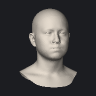 `blow` |  `compress_face` |  `corners_down` | 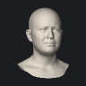 `disgust` |
|  `funneler` | 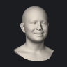 `happy` | 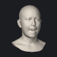 `lips_roll_in` |  `mouth_left` |
| 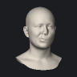 `mouth_right` | 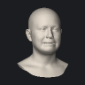 `platysma` | 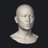 `pucker` |  `smile_wide` |
|  `snarl` | 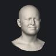 `squint` | 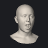 `stretch_face` | 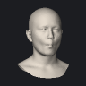 `suck` |
| 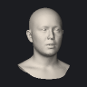 `surprise` | 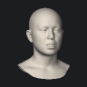 `tongue_center` |  `wink_left` | 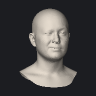 `wink_right` |
