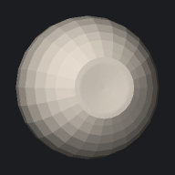
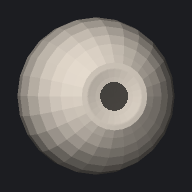
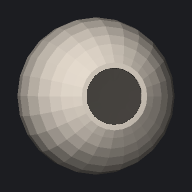

# expression / pupils (1 modes)

[&larr; back to the gallery index](README.md)

| mode | min (&minus;3) | neutral | max (+3) | max &Delta; |
| --- | --- | --- | --- | --- |
| `pupils_000` |  |  |  | 5.2 mm |
