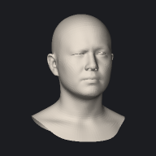
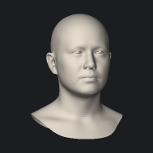

# expression / right_eye_region (100 modes)

[&larr; back to the gallery index](README.md)

| mode | min (&minus;3) | neutral | max (+3) | max &Delta; |
| --- | --- | --- | --- | --- |
| `right_eye_region_000` |  |  |  | 18.4 mm |
| `right_eye_region_001` |  |  |  | 16.3 mm |
| `right_eye_region_002` |  |  |  | 8.2 mm |
| `right_eye_region_003` |  |  |  | 6.6 mm |
| `right_eye_region_004` |  |  |  | 6.7 mm |
| `right_eye_region_005` |  |  |  | 5.1 mm |
| `right_eye_region_006` |  |  |  | 4.1 mm |
| `right_eye_region_007` |  |  |  | 3.1 mm |
| `right_eye_region_008` |  |  |  | 2.3 mm |
| `right_eye_region_009` |  |  |  | 2.5 mm |
| `right_eye_region_010` |  |  |  | 2.0 mm |
| `right_eye_region_011` |  |  |  | 2.0 mm |
| `right_eye_region_012` |  |  |  | 2.0 mm |
| `right_eye_region_013` |  |  |  | 1.5 mm |
| `right_eye_region_014` |  |  |  | 1.5 mm |
| `right_eye_region_015` |  |  |  | 1.4 mm |
| `right_eye_region_016` |  |  |  | 1.7 mm |
| `right_eye_region_017` |  |  |  | 1.4 mm |
| `right_eye_region_018` |  |  |  | 1.1 mm |
| `right_eye_region_019` |  |  |  | 1.2 mm |
| `right_eye_region_020` |  |  |  | 1.1 mm |
| `right_eye_region_021` |  |  |  | 1.2 mm |
| `right_eye_region_022` |  |  |  | 1.1 mm |
| `right_eye_region_023` |  |  |  | 1.0 mm |
| `right_eye_region_024` |  |  |  | 1.1 mm |
| `right_eye_region_025` |  |  |  | 1.2 mm |
| `right_eye_region_026` |  |  |  | 1.1 mm |
| `right_eye_region_027` |  |  |  | 1.1 mm |
| `right_eye_region_028` |  |  |  | 1.0 mm |
| `right_eye_region_029` |  |  |  | 1.6 mm |
| `right_eye_region_030` |  |  |  | 0.8 mm |
| `right_eye_region_031` |  |  |  | 1.0 mm |
| `right_eye_region_032` |  |  |  | 0.7 mm |
| `right_eye_region_033` |  |  |  | 0.7 mm |
| `right_eye_region_034` |  |  |  | 0.9 mm |
| `right_eye_region_035` |  |  |  | 0.8 mm |
| `right_eye_region_036` |  |  |  | 0.7 mm |
| `right_eye_region_037` |  |  |  | 0.6 mm |
| `right_eye_region_038` |  |  |  | 0.7 mm |
| `right_eye_region_039` |  |  |  | 0.7 mm |
| `right_eye_region_040` |  |  |  | 0.7 mm |
| `right_eye_region_041` |  |  |  | 0.6 mm |
| `right_eye_region_042` |  |  |  | 0.7 mm |
| `right_eye_region_043` |  |  |  | 0.8 mm |
| `right_eye_region_044` |  |  |  | 0.5 mm |
| `right_eye_region_045` |  |  |  | 0.5 mm |
| `right_eye_region_046` |  |  |  | 0.7 mm |
| `right_eye_region_047` |  |  |  | 0.5 mm |
| `right_eye_region_048` |  |  |  | 0.5 mm |
| `right_eye_region_049` |  |  |  | 0.5 mm |
| `right_eye_region_050` |  |  |  | 0.7 mm |
| `right_eye_region_051` |  |  |  | 0.4 mm |
| `right_eye_region_052` |  |  |  | 0.4 mm |
| `right_eye_region_053` |  |  |  | 0.5 mm |
| `right_eye_region_054` |  |  |  | 0.4 mm |
| `right_eye_region_055` |  |  |  | 0.4 mm |
| `right_eye_region_056` |  |  |  | 0.5 mm |
| `right_eye_region_057` |  |  |  | 0.5 mm |
| `right_eye_region_058` |  |  |  | 0.4 mm |
| `right_eye_region_059` |  |  |  | 0.6 mm |
| `right_eye_region_060` |  |  |  | 0.4 mm |
| `right_eye_region_061` |  |  |  | 0.4 mm |
| `right_eye_region_062` |  |  |  | 0.4 mm |
| `right_eye_region_063` |  |  |  | 0.4 mm |
| `right_eye_region_064` |  |  |  | 0.4 mm |
| `right_eye_region_065` |  |  |  | 0.4 mm |
| `right_eye_region_066` |  |  |  | 0.4 mm |
| `right_eye_region_067` |  |  |  | 0.4 mm |
| `right_eye_region_068` |  |  |  | 0.4 mm |
| `right_eye_region_069` |  |  |  | 0.3 mm |
| `right_eye_region_070` |  |  |  | 0.4 mm |
| `right_eye_region_071` |  |  |  | 0.4 mm |
| `right_eye_region_072` |  |  |  | 0.4 mm |
| `right_eye_region_073` |  |  |  | 0.5 mm |
| `right_eye_region_074` |  |  |  | 0.4 mm |
| `right_eye_region_075` |  |  |  | 0.3 mm |
| `right_eye_region_076` |  |  |  | 0.3 mm |
| `right_eye_region_077` |  |  |  | 0.5 mm |
| `right_eye_region_078` |  |  |  | 0.3 mm |
| `right_eye_region_079` |  |  |  | 0.4 mm |
| `right_eye_region_080` |  |  |  | 0.3 mm |
| `right_eye_region_081` |  |  |  | 0.3 mm |
| `right_eye_region_082` |  |  |  | 0.3 mm |
| `right_eye_region_083` |  |  |  | 0.3 mm |
| `right_eye_region_084` |  |  |  | 0.4 mm |
| `right_eye_region_085` |  |  |  | 0.2 mm |
| `right_eye_region_086` |  |  |  | 0.3 mm |
| `right_eye_region_087` |  |  |  | 0.3 mm |
| `right_eye_region_088` |  |  |  | 0.3 mm |
| `right_eye_region_089` |  |  |  | 0.3 mm |
| `right_eye_region_090` |  |  |  | 0.3 mm |
| `right_eye_region_091` |  |  |  | 0.3 mm |
| `right_eye_region_092` |  |  |  | 0.3 mm |
| `right_eye_region_093` |  |  |  | 0.3 mm |
| `right_eye_region_094` |  |  |  | 0.3 mm |
| `right_eye_region_095` |  |  |  | 0.3 mm |
| `right_eye_region_096` |  |  |  | 0.3 mm |
| `right_eye_region_097` |  |  |  | 0.3 mm |
| `right_eye_region_098` |  |  |  | 0.2 mm |
| `right_eye_region_099` |  |  |  | 0.2 mm |
