# expression / tongue (32 modes)

[&larr; back to the gallery index](README.md)

| mode | min (&minus;3) | neutral | max (+3) |
| --- | --- | --- | --- |
| `tongue_mean` | 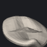 | 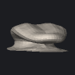 | 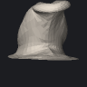 |
| `tongue_000` | 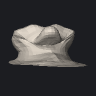 |  | 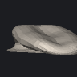 |
| `tongue_001` | 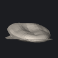 |  | 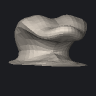 |
| `tongue_002` |  |  | 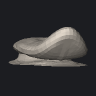 |
| `tongue_003` | 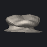 |  | 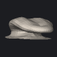 |
| `tongue_004` | 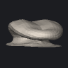 |  | 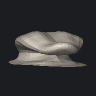 |
| `tongue_005` |  |  |  |
| `tongue_006` | 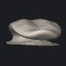 |  | 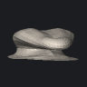 |
| `tongue_007` | 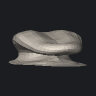 |  | 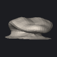 |
| `tongue_008` | 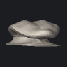 |  | 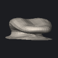 |
| `tongue_009` |  |  | 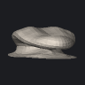 |
| `tongue_010` |  |  | 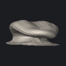 |
| `tongue_011` | 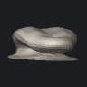 |  |  |
| `tongue_012` | 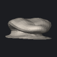 |  |  |
| `tongue_013` | 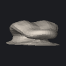 |  | 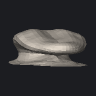 |
| `tongue_014` | 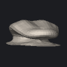 |  | 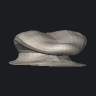 |
| `tongue_015` | 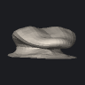 |  | 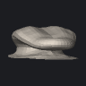 |
| `tongue_016` | 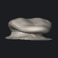 |  | 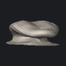 |
| `tongue_017` | 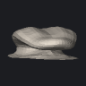 |  | 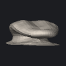 |
| `tongue_018` | 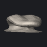 |  | 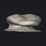 |
| `tongue_019` | 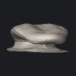 |  | 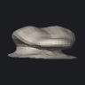 |
| `tongue_020` | 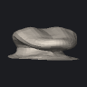 |  |  |
| `tongue_021` |  |  | 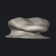 |
| `tongue_022` |  |  | 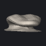 |
| `tongue_023` | 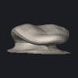 |  | 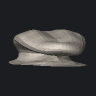 |
| `tongue_024` | 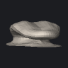 |  | 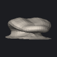 |
| `tongue_025` |  |  | 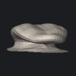 |
| `tongue_026` | 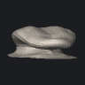 |  | 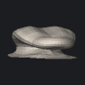 |
| `tongue_027` | 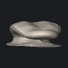 |  | 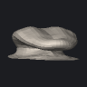 |
| `tongue_028` | 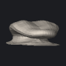 |  | 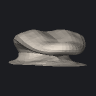 |
| `tongue_029` |  |  |  |
| `tongue_030` |  |  |  |
