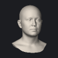

# identity / eyes (3 modes)

[&larr; back to the gallery index](README.md)

| mode | min (&minus;3) | neutral | max (+3) |
| --- | --- | --- | --- |
| `eyes_000` |  |  |  |
| `eyes_001` |  |  |  |
| `eyes_002` |  |  |  |
