# identity / head (170 modes)

[&larr; back to the gallery index](README.md)

| mode | min (&minus;3) | neutral | max (+3) |
| --- | --- | --- | --- |
| `head_000` |  |  | 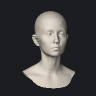 |
| `head_001` | 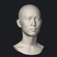 |  |  |
| `head_002` |  |  | 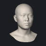 |
| `head_003` | 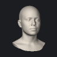 |  |  |
| `head_004` |  |  | 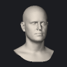 |
| `head_005` | 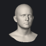 |  | 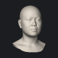 |
| `head_006` | 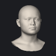 |  |  |
| `head_007` | 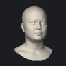 |  | 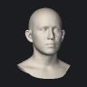 |
| `head_008` |  |  |  |
| `head_009` | 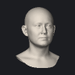 |  |  |
| `head_010` | 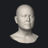 |  |  |
| `head_011` |  |  | 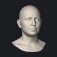 |
| `head_012` | 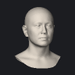 |  |  |
| `head_013` |  |  |  |
| `head_014` | 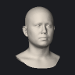 |  |  |
| `head_015` |  |  |  |
| `head_016` |  |  |  |
| `head_017` |  |  |  |
| `head_018` |  |  |  |
| `head_019` |  |  |  |
| `head_020` |  |  |  |
| `head_021` |  |  |  |
| `head_022` |  |  |  |
| `head_023` |  |  |  |
| `head_024` | 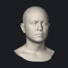 |  |  |
| `head_025` |  |  |  |
| `head_026` |  |  |  |
| `head_027` |  |  |  |
| `head_028` |  |  |  |
| `head_029` |  |  |  |
| `head_030` |  |  |  |
| `head_031` | 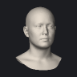 |  |  |
| `head_032` |  |  |  |
| `head_033` |  |  |  |
| `head_034` |  |  |  |
| `head_035` |  |  | 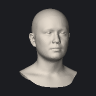 |
| `head_036` | 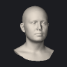 |  |  |
| `head_037` |  |  |  |
| `head_038` |  |  |  |
| `head_039` |  |  |  |
| `head_040` |  |  |  |
| `head_041` |  |  |  |
| `head_042` |  |  |  |
| `head_043` |  |  |  |
| `head_044` |  |  |  |
| `head_045` |  |  |  |
| `head_046` |  |  |  |
| `head_047` |  |  |  |
| `head_048` |  |  |  |
| `head_049` |  |  |  |
| `head_050` |  |  |  |
| `head_051` |  |  |  |
| `head_052` |  |  |  |
| `head_053` |  |  |  |
| `head_054` |  |  |  |
| `head_055` |  |  |  |
| `head_056` |  |  |  |
| `head_057` |  |  |  |
| `head_058` |  |  |  |
| `head_059` |  |  |  |
| `head_060` |  |  |  |
| `head_061` |  |  |  |
| `head_062` |  |  |  |
| `head_063` |  |  |  |
| `head_064` |  |  |  |
| `head_065` |  |  |  |
| `head_066` |  |  |  |
| `head_067` |  |  |  |
| `head_068` |  |  |  |
| `head_069` |  |  |  |
| `head_070` |  |  |  |
| `head_071` |  |  |  |
| `head_072` |  |  |  |
| `head_073` |  |  |  |
| `head_074` |  |  |  |
| `head_075` |  |  |  |
| `head_076` |  |  |  |
| `head_077` |  |  |  |
| `head_078` |  |  |  |
| `head_079` |  |  |  |
| `head_080` |  |  |  |
| `head_081` |  |  |  |
| `head_082` |  |  |  |
| `head_083` |  |  |  |
| `head_084` |  |  |  |
| `head_085` |  |  |  |
| `head_086` |  |  |  |
| `head_087` |  |  |  |
| `head_088` |  |  |  |
| `head_089` |  |  |  |
| `head_090` |  |  |  |
| `head_091` |  |  |  |
| `head_092` |  |  |  |
| `head_093` |  |  |  |
| `head_094` |  |  |  |
| `head_095` |  |  |  |
| `head_096` |  |  |  |
| `head_097` |  |  |  |
| `head_098` |  |  |  |
| `head_099` |  |  |  |
| `head_100` |  |  |  |
| `head_101` |  |  |  |
| `head_102` |  |  |  |
| `head_103` |  |  |  |
| `head_104` |  |  |  |
| `head_105` |  |  |  |
| `head_106` |  |  |  |
| `head_107` |  |  |  |
| `head_108` |  |  |  |
| `head_109` |  |  |  |
| `head_110` |  |  |  |
| `head_111` |  |  |  |
| `head_112` |  |  |  |
| `head_113` |  |  |  |
| `head_114` |  |  |  |
| `head_115` |  |  |  |
| `head_116` |  |  |  |
| `head_117` |  |  |  |
| `head_118` |  |  |  |
| `head_119` |  |  |  |
| `head_120` |  |  |  |
| `head_121` |  |  |  |
| `head_122` |  |  |  |
| `head_123` |  |  |  |
| `head_124` |  |  |  |
| `head_125` |  |  |  |
| `head_126` |  |  |  |
| `head_127` |  |  |  |
| `head_128` |  |  |  |
| `head_129` |  |  |  |
| `head_130` |  |  |  |
| `head_131` |  |  |  |
| `head_132` |  |  |  |
| `head_133` |  |  |  |
| `head_134` |  |  |  |
| `head_135` |  |  |  |
| `head_136` |  |  |  |
| `head_137` |  |  |  |
| `head_138` |  |  |  |
| `head_139` |  |  |  |
| `head_140` |  |  |  |
| `head_141` |  |  |  |
| `head_142` |  |  |  |
| `head_143` |  |  |  |
| `head_144` |  |  |  |
| `head_145` |  |  |  |
| `head_146` |  |  |  |
| `head_147` |  |  |  |
| `head_148` |  |  |  |
| `head_149` |  |  |  |
| `head_150` |  |  |  |
| `head_151` |  |  |  |
| `head_152` |  |  |  |
| `head_153` |  |  |  |
| `head_154` |  |  |  |
| `head_155` |  |  |  |
| `head_156` |  |  |  |
| `head_157` |  |  |  |
| `head_158` |  |  |  |
| `head_159` |  |  |  |
| `head_160` |  |  |  |
| `head_161` |  |  |  |
| `head_162` |  |  |  |
| `head_163` |  |  |  |
| `head_164` |  |  |  |
| `head_165` |  |  |  |
| `head_166` |  |  |  |
| `head_167` |  |  |  |
| `head_168` |  |  |  |
| `head_169` |  |  |  |
