# identity / teeth (80 modes)

[&larr; back to the gallery index](README.md)

| mode | min (&minus;3) | neutral | max (+3) |
| --- | --- | --- | --- |
| `teeth_000` | 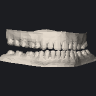 |  | 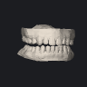 |
| `teeth_001` | 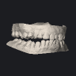 |  | 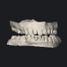 |
| `teeth_002` | 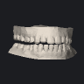 |  | 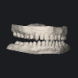 |
| `teeth_003` | 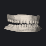 |  |  |
| `teeth_004` |  |  |  |
| `teeth_005` | 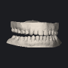 |  | 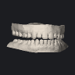 |
| `teeth_006` | 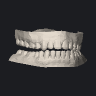 |  | 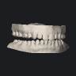 |
| `teeth_007` | 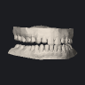 |  | 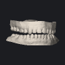 |
| `teeth_008` | 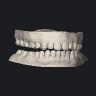 |  |  |
| `teeth_009` | 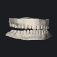 |  | 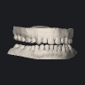 |
| `teeth_010` |  |  |  |
| `teeth_011` |  |  | 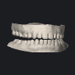 |
| `teeth_012` |  |  | 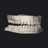 |
| `teeth_013` |  |  |  |
| `teeth_014` |  |  | 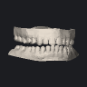 |
| `teeth_015` | 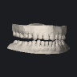 |  |  |
| `teeth_016` | 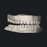 |  | 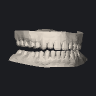 |
| `teeth_017` |  |  | 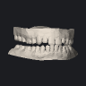 |
| `teeth_018` | 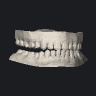 |  | 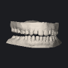 |
| `teeth_019` |  |  |  |
| `teeth_020` |  |  |  |
| `teeth_021` | 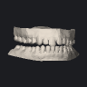 |  | 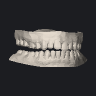 |
| `teeth_022` |  |  | 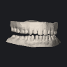 |
| `teeth_023` | 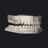 |  | 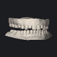 |
| `teeth_024` |  |  |  |
| `teeth_025` |  |  |  |
| `teeth_026` |  |  |  |
| `teeth_027` |  |  |  |
| `teeth_028` |  |  |  |
| `teeth_029` |  |  |  |
| `teeth_030` |  |  |  |
| `teeth_031` |  |  |  |
| `teeth_032` |  |  |  |
| `teeth_033` |  |  | 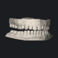 |
| `teeth_034` |  |  | 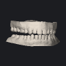 |
| `teeth_035` |  |  |  |
| `teeth_036` |  |  | 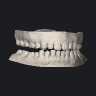 |
| `teeth_037` |  |  |  |
| `teeth_038` |  |  |  |
| `teeth_039` | 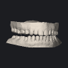 |  | 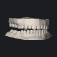 |
| `teeth_040` | 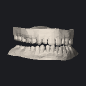 |  |  |
| `teeth_041` |  |  |  |
| `teeth_042` |  |  |  |
| `teeth_043` |  |  | 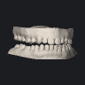 |
| `teeth_044` | 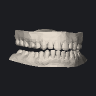 |  |  |
| `teeth_045` |  |  |  |
| `teeth_046` |  |  | 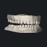 |
| `teeth_047` |  |  |  |
| `teeth_048` | 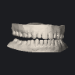 |  | 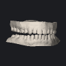 |
| `teeth_049` |  |  |  |
| `teeth_050` |  |  |  |
| `teeth_051` | 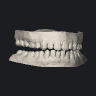 |  |  |
| `teeth_052` |  |  |  |
| `teeth_053` |  |  |  |
| `teeth_054` |  |  |  |
| `teeth_055` |  |  |  |
| `teeth_056` |  |  |  |
| `teeth_057` |  |  |  |
| `teeth_058` |  |  |  |
| `teeth_059` | 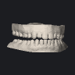 |  |  |
| `teeth_060` |  |  |  |
| `teeth_061` |  |  |  |
| `teeth_062` |  |  |  |
| `teeth_063` |  |  |  |
| `teeth_064` |  |  |  |
| `teeth_065` |  |  |  |
| `teeth_066` |  |  |  |
| `teeth_067` |  |  |  |
| `teeth_068` |  |  |  |
| `teeth_069` | 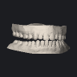 |  |  |
| `teeth_070` |  |  |  |
| `teeth_071` |  |  |  |
| `teeth_072` |  |  |  |
| `teeth_073` |  |  |  |
| `teeth_074` |  |  |  |
| `teeth_075` |  |  |  |
| `teeth_076` |  |  |  |
| `teeth_077` |  |  |  |
| `teeth_078` |  |  |  |
| `teeth_079` |  |  |  |
